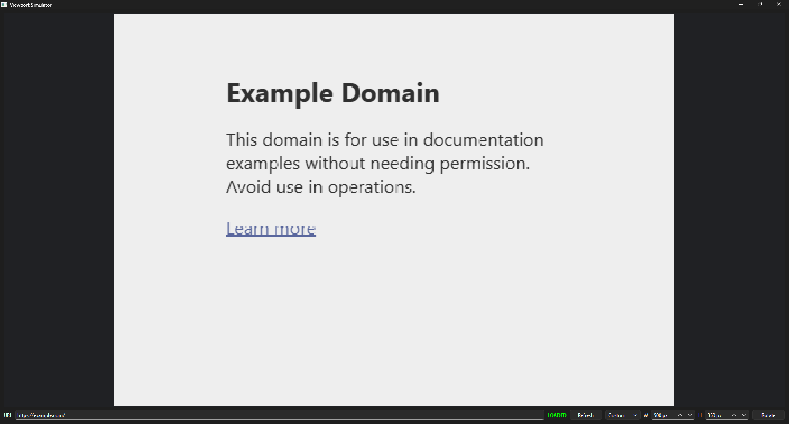

# Webpage Testing Toolbox

Webpage Testing Toolbox is a desktop testing suite for inspecting websites at their real target resolutions. The current tool opens a URL in an embedded Chromium-based browser and simulates the selected viewport size, so responsive layouts can be reviewed at the same CSS width and height they would receive on a mobile device, tablet, laptop, or desktop display.

The application is designed to grow into a collection of focused webpage-testing tools. The viewport simulator is the first tool in that suite.



## Current tool: viewport simulator

- Load any webpage by entering its URL.
- Preview common viewport presets: mobile, tablet, laptop, and desktop.
- Set a custom viewport width and height.
- Rotate the simulated viewport between portrait and landscape orientations.
- Refresh the page while bypassing the cache.
- Keep the simulated page centered and scaled to fit the application window while preserving the selected simulated resolution.

## Requirements

- Python 3
- Windows or Linux
- A display environment capable of running PySide6 and Qt WebEngine

The setup script creates the project's local `venv` virtual environment and automatically installs all required dependencies from [`venv_creation_components/requirements.txt`](venv_creation_components/requirements.txt). No separate `pip install` step is required.

## Setup and running

Run these commands from the repository root. The setup script only needs to be run the first time, or when the environment needs to be recreated.

### Windows

Create the environment and install dependencies:

```bat
venv_creation_components\create_venv_windows.bat
```

Start the application using the Windows launcher:

```bat
run_windows.bat
```

### Linux

Create the environment and install dependencies:

```bash
./venv_creation_components/create_venv_linux.sh
```

Start the application using the Linux launcher:

```bash
./run_linux.sh
```

Always start the application with the run script for your operating system. The run script activates the correct virtual environment and applies the platform-specific launch configuration before starting the application; do not run `main/view_tester.py` directly.

## Usage

1. Start the application with the appropriate run script.
2. Enter a webpage URL in the address field.
3. Choose a preset, or select **Custom** and enter the desired width and height.
4. Click **Refresh** to reload the page, or **Rotate** to swap the viewport dimensions.

## Roadmap

The following tools are planned additions to the testing suite:

- [ ] Bulk domain-wide console error checker
- [ ] Network speed bottleneck simulator

## Project structure

```text
main/
|-- view_tester.py              # Main application window and controls
|-- preview.py                  # Viewport module for main application
`-- dd_workaround/              # Embedded-browser dropdown workaround
assets/
`-- view_tester.PNG             # Application preview image
```

## License

This project is open source and distributed under the terms of the [MIT License](LICENSE).
